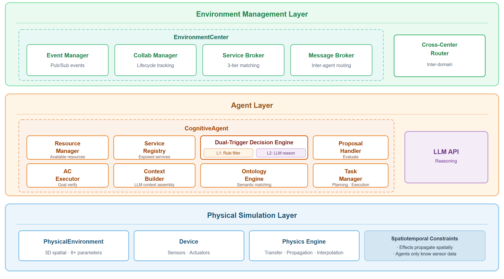

# Distributed Embodiment Framework

Code repository for the paper *"Distributed Embodiment: Enabling Autonomous AI Agent Collaboration through IoT Infrastructure"*.

## Overview

**Distributed Embodiment** proposes a paradigm where one cognitive AI agent interacts with the physical world through N IoT devices distributed across space (1 brain : N bodies). Because no single agent's distributed "body" covers all physical capabilities, agents must autonomously decide when and how to collaborate. This framework implements **Active Collaboration (AC)**, the mechanism by which agents make these decisions.

## Architecture

The framework implements three layers connected by event-driven data flow:

```
┌─────────────────────────────────────────────────┐
│          Environment Management Layer            │
│  EventManager · CollaborationManager            │
│  ServiceBroker · MessageBroker                  │
├─────────────────────────────────────────────────┤
│               Agent Layer                        │
│  CognitiveAgent (per agent)                     │
│  ├─ Dual-Trigger Decision Engine (L1: rules,    │
│  │  L2: LLM reasoning)                          │
│  ├─ ResourceManager · ServiceRegistry           │
│  ├─ ProposalHandler · ACExecutor                │
│  └─ ContextBuilder · OntologyEngine             │
│          ↕ LLM API                              │
├─────────────────────────────────────────────────┤
│         Physical Simulation Layer                │
│  PhysicalEnvironment (3D spatial, 8+ parameters)│
│  Device (Sensors · Actuators)                   │
│  PhysicsEngine (transfer · propagation)         │
│  Spatiotemporal Constraints                     │
└─────────────────────────────────────────────────┘
```



## Project Structure

```
packages/
  core/
    src/
      decision/            # ACNecessityAssessor, DualTriggerACManager
      utils/               # text-similarity (TF-IDF baseline)
    tests/
      experiments/
        execution/         # Experiment test scripts
        infrastructure/    # Runner, types, ground truth, metrics
      experiment-results/
        unified/           # Final results (193 JSON files)
  simulation/              # Physical environment, physics engine, devices
  shared/                  # Shared types and utilities
  llm-integration/         # LLM client (Ollama)
config/
  scenarios/               # Scenario configurations
```

## Running Experiments

### Prerequisites

- Node.js >= 18, npm >= 9
- [Ollama](https://ollama.ai) running locally with `qwen3-14b-q4`

### Setup

```bash
npm install
npm run build
```

### Experiments

| Experiment | Description |
|------------|-------------|
| exp-1 | Decision accuracy vs. 5 baselines (RQ1) |
| exp-2 | Service discovery and spatial precision ablation (RQ2) |
| exp-3 | Cross-scenario distribution cost (RQ3) |
| exp-4 | Broadcast resilience under noise (RQ4) |
| exp-5 | Token consumption and decision latency (RQ5) |
| exp-6 | End-to-end collaboration execution (RQ6) |
| exp-7 | Multi-model evaluation |
| exp-8 | Layer 1 noise filtering |
| exp-9 | N=5 statistical reliability |
| tfidf-baseline | TF-IDF non-LLM baseline |

### Usage

```bash
# Run a single experiment
npx vitest run packages/core/tests/experiments/execution/exp-1-effectiveness.vitest.test.ts

# Run all
npx vitest run packages/core/tests/experiments/execution/
```

Results are written to `packages/core/tests/experiment-results/unified/`.

## Key Results

| Condition | Decision Accuracy |
|-----------|------------------:|
| Full AC (qwen3-14b) | 93.3% |
| Oracle (perfect info) | 94.2% |
| TF-IDF baseline | 64.0% |
| Rule-only | 23.0% |
| Always collaborate | 68.3% |
| Never collaborate | 36.7% |

**Key findings:**
- Service discovery is the primary mechanism (removing it drops accuracy by 42.5pp)
- Distribution cost (accuracy gap vs. Oracle) is near zero across all scenarios and models
- The result holds across 5 LLMs (7B local to state-of-the-art API models)

## License

[MIT](./LICENSE)
